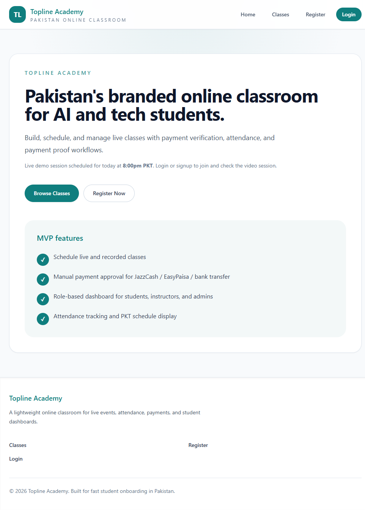
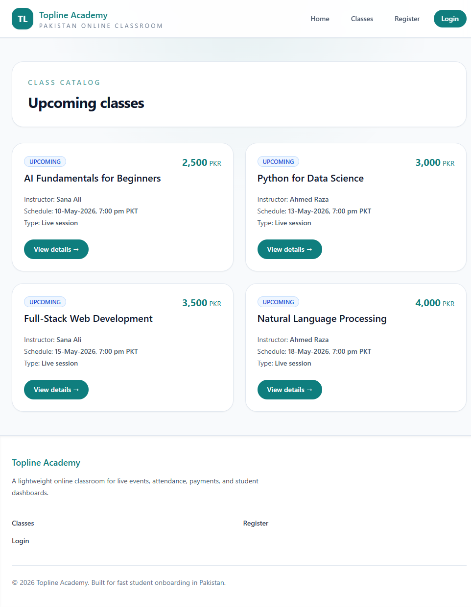
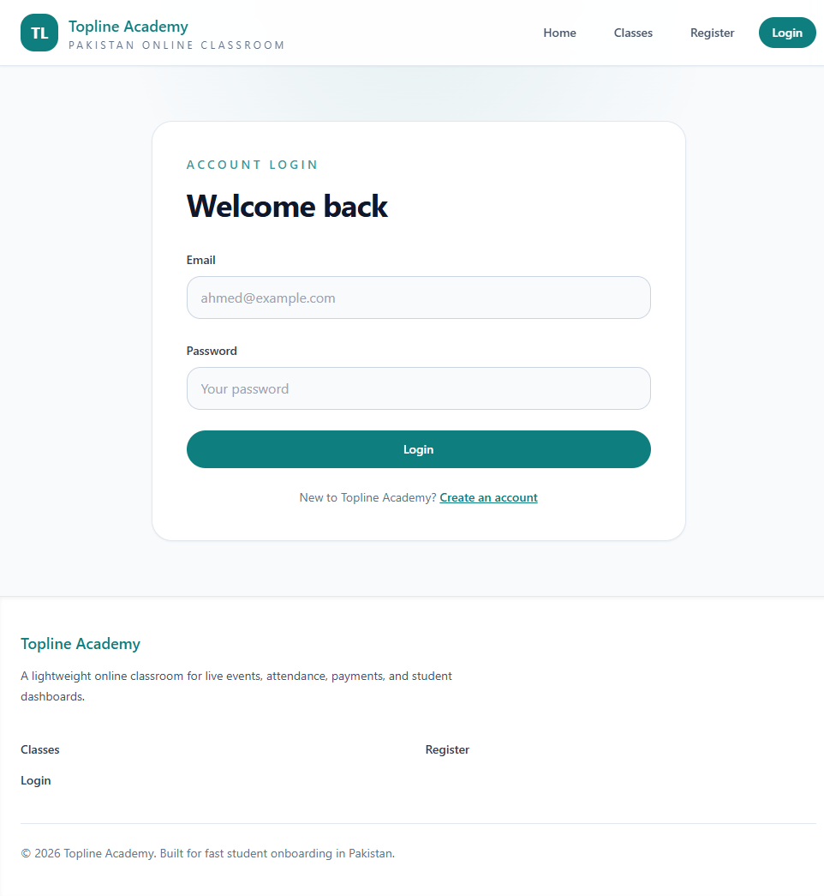

# Topline Academy Beginner Guide

This beginner guide walks you through the Topline Academy MVP setup, architecture, core flows, and service integrations.

## 1. Overview

Topline Academy is a Next.js 14 app built for live and recorded class management.
It supports role-based dashboards for students, instructors, and admins.
The app uses JWT cookie authentication, Prisma for PostgreSQL access, Resend for email, and Daily for embedded video sessions.

## 2. Local setup

### Prerequisites

- Node.js 20+ / npm
- PostgreSQL or Supabase database
- A code editor like VS Code
- Optional: Vercel account for deployment

### Install dependencies

```bash
npm install
```

### Configure environment

Copy the example file and update values:

```bash
cp .env.example .env
```

Set the following values in `.env`:

- `DATABASE_URL` — PostgreSQL connection string
- `JWT_SECRET` — secret for signing session tokens
- `RESEND_API_KEY` — Resend API key for outgoing email
- `SUPABASE_URL` — Supabase project URL
- `SUPABASE_ANON_KEY` — Supabase public key
- `SUPABASE_SERVICE_KEY` — Supabase service role key
- `DAILY_API_KEY` — Daily.co API key
- `NEXT_PUBLIC_DAILY_DOMAIN` — Daily domain, e.g. `toplineacademy.daily.co`
- `NEXT_PUBLIC_DAILY_ROOM` — default Daily room name

### Generate Prisma client

```bash
npm run prisma:generate
```

### Start development server

```bash
npm run dev
```

Open the app at: `http://localhost:3000` or the port shown by Next.js.

## 3. Project structure

- `src/app` — Next.js App Router pages and API routes
- `src/components` — shared UI components
- `src/lib` — helper utilities and database connectors
- `prisma/schema.prisma` — database models
- `docs/` — project documentation and screenshots

## 4. Authentication and session flow

Topline Academy uses JWT cookies for session management.

### Key files

- `src/lib/auth.ts` — password hashing and JWT token utilities
- `src/lib/get-session.ts` — reads the `topline_session` cookie and verifies JWT
- `src/app/api/auth/register/route.ts` — registers new users
- `src/app/api/auth/login/route.ts` — logs users in and sets the cookie
- `src/app/api/auth/me/route.ts` — returns authenticated user info
- `src/app/api/auth/logout/route.ts` — clears the session cookie

### Roles

The app supports three roles:

- `STUDENT`
- `INSTRUCTOR`
- `ADMIN`

The role is stored in the JWT payload and used for UI flow and API authorization.

## 5. How enrollment works

Students browse classes in `/classes` and open class details.

If a student is not logged in, the UI prompts them to login or register.
When a student clicks `Enroll now`, the app calls:

- `POST /api/classes/[id]/enroll`

That endpoint verifies the session and the `STUDENT` role.
If the student is already enrolled, the request is rejected.

After enrollment, the request is saved with status `PENDING`.
Admins can approve or reject enrollments from the admin dashboard.

## 6. Admin service health checks

A health endpoint is available at:

- `GET /api/health`

The admin dashboard also displays integration status for:

- `database`
- `resend`
- `daily`

This is useful to confirm the required environment variables are configured.

## 7. Screenshots

Home page:



Classes page:



Login page:



## 8. Key pages

- `/` — landing page
- `/classes` — class catalog
- `/classes/[id]` — class detail and enrollment
- `/login` — login page
- `/register` — registration page
- `/dashboard/student` — student dashboard
- `/dashboard/instructor` — instructor dashboard
- `/admin` — admin dashboard

## 9. Common maintenance tasks

### Reset Prisma schema

```bash
npm run prisma:migrate
```

### Rebuild the app

```bash
npm run build
```

### Verify TypeScript

```bash
npx tsc --noEmit
```

## 10. Notes for next improvements

- Add actual Daily room creation from the server using the Daily API
- Wire email notifications for enrollment events
- Add tests for key auth and API flows
- Harden role-based route protection on the server
- Add payment proof upload and approval workflow

---

This document is a quick starter guide for onboarding new developers into the Topline Academy project.
